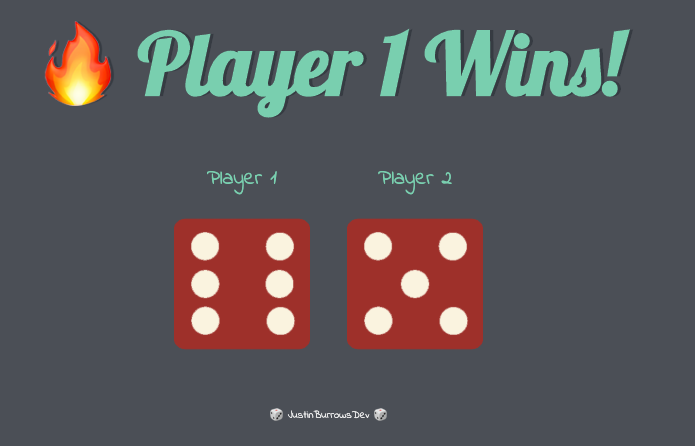

# Dice-Website

## Challenges I Faced?

I had difficulty understanding how to put the randomization of a dice roll into JavaScript.

## How Did I Over Come Those Challenges? 

The collaboration with my peers I gained a better understanding of how the program might work. However, before I wrote a line of code I wrote out what I wanted to happen step-by-step on a whiteboard. Once I had a general idea of how the program should work I began to take the logic that I wrote out in common english and translated into JavaScript bit by bit. By leveraging platforms like Google, YouTube, MDN docs, Stackoverflow, GitHub, online courses, bootcamps and reference guides I was able to find the proper JavaScript methods and functions needed to complete the task and I programmed the dice website accordingly.

## What Did I Learn? 

* Became more familiar with declaring JavaScript variables
* Gain a deeper understanding of JavaScript functions
* Received more practice with manipulating the DOM 
* Obtained more knowledge on using if statements in JavaScript

